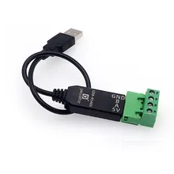
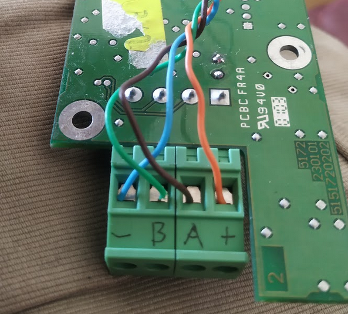

# nilan-cts600-homeassistant

This is a Home Assistant integration for the Nilan CTS600 HVAC control
system, controlling e.g. the [Nilan
VPL-15](https://www.en.nilan.dk/products/ventilation-with-cooling-heating/heat-pump-and-heat-pipe/vpl-15)
ventilation unit. This integration, via a serial Modbus adapter, is to
be connected to the ventilation unit and replaces the physical control
panel.

Currently, this integration implements the
[Climate](https://www.home-assistant.io/integrations/climate/)
interface for Home Assistant. This means that you can set the
ventilation unit's mode (auto, heat, cool, or off) and its target
temperature. You can also set the fan speed (1, 2, 3, or 4). Finally,
the thermometer in the physical control panel (Nilan sensor T15) is
replaced with any HA entity, typically a temperature sensor.

# What is this integration for? #

The Nilan VPL-15 ventilation unit (and similar units from Nilan) have
been delivered with a range of control systems over the years,
starting I believe with simple analog controls back in the day, until
todays modern CTS602 or CTS700-based control systems that support LAN
interfacing, mobile apps and whatnot.

This integration is specifically for units controlled via the CTS600
interface. Historically this is an intermediate technology, and
obsolete now since a number of years, which is digital but not really
designed to be interfaced or integrated with other systems.

There exists a different integration in HACS for CTS602-based systems,
named
[Nilan](https://github.com/veista/nilan).

This integration is created for my Nilan VPL-15 ventilation unit
controlled by CTS600. There are other Nilan ventilation units provided
with the CTS600 controller. These systems may or may not work as
is. If you have such a non-VPL-15 system, I'd be interested in making
this integration work, so please test and open an Github issue for
this purpose.

The following is a list of Nilan ventilation units other than the
VPL-15 that I believe have been delivered with the CTS600 controller:
  * Comfort-450
  * Comfort-600
  * Comfort-300
  * VPL-28
  * VP-18 M2
  * VGU-250

# Serial RS485 adapter

An adapter is required to interface the CTS600 to the PC running Home
Assistant. I am using a USB serial RS485 (modbus) adapter. These come
in many shapes and colours. I reccommend the one that is black with
green screw terminals and a USB pigtail. [Link to
Aliexpress.](https://www.aliexpress.com/item/1005004520479272.html)
I'd advise against the blue translucent ones.

## Physical connection

The Nilan VPL-15 (and presumably other) unit connects to the physical
control panel via 4 wires. Two wires provides 12V power, and the
remaining two are the RS485 A and B communication wires.

Only the two A and B communication wires must be connected to the USB
adapter. These will be labeled on the adapter. **Do not connect the
power wires to the adapter**, as this will likely destroy your
adapter, and possibly also your PC and/or ventilation unit!

The image below identifies the wires on the side of the original
control panel.

# Configuration

This integration currently supports only manual configuration in
configuration.yaml, for example:

    climate:
      platform: nilan_cts600
      name: LoftCTS600
      retries: 3
      sensor_T15: input_number.stuetemp
      port: /dev/ttyUSB0

These are the configuration entries:

  * `name`: Any name you choose to identify the ventilation unit.
  * `retries`: The number of times to retry a CTS600 request before failing.
  * `sensor_T15`: Names the entity that provides the value for the
    room temperature, substituting the temperature sensor in the
    original control panel.
  * `port`: The device node corresponding to your RS485 adapter. If
    you have no other USB serial adapters installed, this will be
    `/dev/ttyUSB0`.

# Operation

This integration emulates the physical control panel. You can
(currently) not use the physical control panel while using this
integration.

## About the CTS600

The CTS600 appears to use a pseudo-modbus protocol atop of RS485,
where the control panel is the master and the ventilation unit
(controller) is the slave. However, the communications is not based on
standard modbus registers. Rather, the CTS600 employs some "custom"
modbus function codes, such that the basic communications structure
(after initialization) is like this:

- The panel sends a custom "request" that informs the controller of
  the state of the six buttons.
- The controller "responds" with a somewhat random status update: the
  text for the display, or the state of the status LED.
- Repeat forever, several times every second.

The CTS600 will accept and respond to standard modbus register
commands, but I have not found a way to control or query the
ventilation controller this way.

## About the emulation of the control panel

Because standard modbus registers don't work, the integration is
reduced to emulating the physical control panel. That is, it emulates
pressing the buttons and parsing the display text, just as a human
would do. This is rather inefficient, but seems to work. These are
some consequences of this mode of operation:
- In order to parse the text display, during initialization the
  integration will switch the controller interface language to
  english.
- The precision of temperature values is limited to that displayed on
  the physical control panel, i.e. mostly whole integers.
- The integration must make some assumptions about the nature of the
  controller menus. These might change between controller versions and
  ventilation unit models. Consequently, it's difficult to predict
  interoperability between versions and models, but it should be easy
  to adapt.
  
## About the T15 room temperature sensor

The CTS600 protocol uses some unknown internal 16-bit representation
for the T15 room temperature sensor value. The precision of this
representation is decent, but it appears to be slightly non-linear
with respect to the celsius temperature. Currently a linear
approximation is used. Therefore, the reported T15 value will deviate
slightly from whatever input value you provide (via the `sensor_t15`
configuration entry). The error will increase towards the extremes,
especially below 10°C.

## CTS600 technical information tidbits

These are a few pieces of information about the CTS600 I have come
across that is not directly relevant to the HA integration, but some
might still find useful.

### Power

The CTS600 provides 12 volts power to the control panel. However, the
control panel will operate just fine on 5 volts, and so it can be
hooked up directly to your USB RS486 adapter which typically provides
5 volts. (This would be e.g. for probing the control panel to figure
out its operation.)

### Communication breakdown?

If you find that your control panel is unable to communicate with the
ventilation unit, and you are certain the wiring is correct: The most
likely culprit is the RS485 driver chip that sits on either end of the
communication. The chip is an
[ADM483](https://www.analog.com/media/en/technical-documentation/data-sheets/ADM383.pdf)
8-pin SMD, which is a bit tricky but not impossible to replace for
someone with a bit of experience with a soldering iron. I've had to
replace both of mine. For the CTS600 controller in the ventilation
unit you'll want to remove the PCB from the unit, which is not
difficult if you just take note of where every plug should go back
in. The ADM483 is located right next to the communications connector
on the PCB, on both ends.
